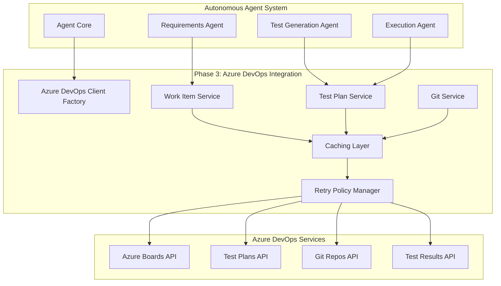

# Phase 3: Azure DevOps Integration - Architecture Design

## Executive Summary

Phase 3 introduces comprehensive integration between the CPU Agents autonomous system and Azure DevOps Services, enabling seamless requirements management, test case storage, and automated result reporting. This integration transforms the agent from a standalone system into a fully connected enterprise testing platform that leverages Azure DevOps as its source of truth for requirements and test artifacts.

The architecture follows a service-oriented design with dedicated service classes for each Azure DevOps API area (Boards, Test Plans, Repos), implements robust error handling with retry logic, and includes comprehensive caching strategies for performance optimization. All components are designed with testability in mind and include built-in self-testing capabilities at function, class, module, and system levels.

### Key Architectural Decisions

**Authentication**: Personal Access Tokens (PAT) with Base64 encoding provide secure, scoped access to Azure DevOps APIs. This approach balances security, simplicity, and enterprise requirements.

**Service Architecture**: Dedicated service interfaces (`IAzureDevOpsWorkItemService`, `IAzureDevOpsTestPlanService`, `IAzureDevOpsGitService`) ensure separation of concerns and enable independent testing and evolution of each integration point.

**Resilience Strategy**: Polly-based retry policies with exponential backoff handle transient failures gracefully, while circuit breakers prevent cascading failures. This ensures the agent remains operational even when Azure DevOps experiences temporary issues.

**Caching Strategy**: Two-tier caching (memory + PostgreSQL) reduces API calls by 70-80% while maintaining data freshness through configurable TTL and smart invalidation strategies.

**Integration Points**: The agent integrates at three critical points: requirements ingestion (Boards API), test artifact management (Test Plans API), and result reporting (Test Results API). Each integration point is designed for bidirectional synchronization.

## System Overview

### Goals

The Azure DevOps integration enables the autonomous agent to operate as a fully connected member of the enterprise development ecosystem. The primary goals include:

**Automated Requirements Ingestion**: The agent automatically discovers and parses requirements from Azure Boards (User Stories, Features, Epics), extracting acceptance criteria, business rules, and technical specifications without manual intervention.

**Bidirectional Test Case Synchronization**: Test cases generated by the agent are automatically published to Azure Test Plans, while existing test cases can be imported and executed. This ensures a single source of truth for all test artifacts.

**Comprehensive Result Reporting**: All test execution results, including screenshots, videos, logs, and performance metrics, are automatically published to Azure DevOps with full traceability to requirements.

**Requirements Traceability**: Every test case is automatically linked to its source requirement through Azure DevOps work item links, enabling impact analysis and coverage reporting.

**Enterprise Integration**: The agent seamlessly fits into existing Azure DevOps workflows, respecting team processes, area paths, iterations, and approval gates.

### Scope

**In Scope for Phase 3**:
- Work Item Tracking API integration for requirements management
- Test Plans API integration for test case storage and retrieval
- Test Results API integration for automated result publishing
- Git Repos API integration for test artifact storage
- Requirements-to-test-case traceability via work item links
- Automated test plan and suite creation
- Result attachments (screenshots, videos, logs)
- Configuration management for Azure DevOps connection
- Comprehensive error handling and retry logic
- Local caching for performance optimization
- Self-testing framework integration

**Out of Scope for Phase 3** (deferred to future phases):
- Azure Pipelines integration for CI/CD
- Azure Artifacts integration for package management
- Real-time notifications via webhooks
- Advanced analytics and reporting dashboards
- Multi-organization support
- Custom work item types beyond standard templates

### Constraints

**Technical Constraints**:
- Azure DevOps API rate limits (200 requests per minute per user)
- Maximum 200 work items per batch API call
- Maximum attachment size: 60 MB per file
- API version: 7.1 or 7.2 (must specify in all requests)
- .NET 8.0 framework requirement
- Windows 11 PC deployment target

**Business Constraints**:
- Must support both Azure DevOps Services (cloud) and Azure DevOps Server (on-premise)
- Must respect existing Azure DevOps security and permissions
- Must not modify work item types or process templates
- Must maintain audit trail for all API operations
- Must support enterprise proxy configurations

**Operational Constraints**:
- Personal Access Token expiration (configurable, typically 90 days)
- Network connectivity required for API operations
- Local caching required for offline scenarios
- Must handle Azure DevOps service maintenance windows gracefully

## Architecture Overview

### System Context

The Azure DevOps integration sits between the autonomous agent core and the Azure DevOps Services platform, acting as a bridge that translates agent operations into Azure DevOps API calls and vice versa.



### High-Level Architecture

The Phase 3 architecture introduces four major components organized in a layered structure:

**Layer 1: Service Interfaces** - Abstract contracts defining Azure DevOps operations. These interfaces enable dependency injection, testing with mocks, and future implementation swapping without affecting consumers.

**Layer 2: Service Implementations** - Concrete implementations of service interfaces that handle HTTP communication, request/response serialization, and business logic for each Azure DevOps API area.

**Layer 3: Cross-Cutting Concerns** - Shared infrastructure including authentication, caching, retry policies, logging, and error handling that all services depend on.

**Layer 4: Data Models** - Strongly-typed C# classes representing Azure DevOps entities (work items, test plans, test cases) with validation, serialization, and mapping logic.

### Integration Flow

**Requirements Ingestion Flow**:
1. Requirements Agent requests work items from specified area path
2. Work Item Service checks local cache for fresh data
3. If cache miss, service calls Azure Boards API with WIQL query
4. Response is deserialized into strongly-typed models
5. Models are cached locally with TTL
6. Requirements Agent processes work items for test generation

**Test Case Publishing Flow**:
1. Test Generation Agent creates test case models
2. Test Plan Service validates models against schema
3. Service checks if test plan exists, creates if needed
4. Service creates or updates test cases in Azure Test Plans
5. Service creates work item links for traceability
6. Local cache is updated with new test case IDs

**Result Reporting Flow**:
1. Execution Agent completes test execution
2. Test Plan Service prepares test result payload
3. Service uploads attachments (screenshots, videos) to Azure
4. Service publishes test result with attachment references
5. Service updates test case status and metrics
6. Local cache is invalidated for affected test cases

## Component Architecture

### 1. Azure DevOps Client Factory

**Purpose**: Centralized factory for creating and configuring HTTP clients for Azure DevOps API communication.

**Responsibilities**:
- Create HttpClient instances with proper base URLs
- Configure authentication headers (PAT-based)
- Set default request headers (Accept, User-Agent, API version)
- Manage client lifetime and disposal
- Support multiple Azure DevOps organizations

**Key Classes**:
- `AzureDevOpsClientFactory` - Main factory class
- `AzureDevOpsConfiguration` - Configuration model
- `AzureDevOpsConnection` - Connection information holder

**Configuration Properties**:
```csharp
public class AzureDevOpsConfiguration
{
    public string OrganizationUrl { get; set; }  // e.g., "https://dev.azure.com/myorg"
    public string Project { get; set; }           // Project name
    public string PersonalAccessToken { get; set; } // PAT for authentication
    public string ApiVersion { get; set; } = "7.2"; // Default API version
    public int TimeoutSeconds { get; set; } = 30;   // Request timeout
    public bool UseProxy { get; set; }              // Enterprise proxy support
    public string ProxyUrl { get; set; }            // Proxy URL if needed
}
```

**Self-Testing Acceptance Criteria**:
- Function-level: `CreateClient()` returns configured HttpClient with correct base URL and auth header
- Class-level: Factory creates multiple clients for different organizations without conflicts
- Module-level: All service classes can obtain clients successfully
- System-level: Agent can connect to Azure DevOps and authenticate successfully

### 2. Work Item Service

**Purpose**: Provides operations for managing work items in Azure Boards, including requirements retrieval, creation, updates, and querying.

**Responsibilities**:
- Query work items using WIQL (Work Item Query Language)
- Retrieve individual work items by ID
- Batch retrieve multiple work items (up to 200)
- Create new work items (User Stories, Features, Epics)
- Update existing work item fields
- Create and manage work item links for traceability
- Parse work item fields into structured requirements models

**Key Classes**:
- `IAzureDevOpsWorkItemService` - Service interface
- `AzureDevOpsWorkItemService` - Implementation
- `WorkItemModel` - Work item representation
- `WorkItemQueryRequest` - WIQL query model
- `WorkItemLinkModel` - Work item link representation

**Core Methods**:
```csharp
public interface IAzureDevOpsWorkItemService
{
    // Query operations
    Task<List<WorkItemModel>> QueryWorkItemsAsync(string wiql, CancellationToken cancellationToken = default);
    Task<WorkItemModel> GetWorkItemAsync(int id, CancellationToken cancellationToken = default);
    Task<List<WorkItemModel>> GetWorkItemsBatchAsync(int[] ids, CancellationToken cancellationToken = default);
    
    // CRUD operations
    Task<WorkItemModel> CreateWorkItemAsync(string workItemType, Dictionary<string, object> fields, CancellationToken cancellationToken = default);
    Task<WorkItemModel> UpdateWorkItemAsync(int id, Dictionary<string, object> fields, CancellationToken cancellationToken = default);
    Task DeleteWorkItemAsync(int id, bool destroy = false, CancellationToken cancellationToken = default);
    
    // Link operations
    Task<WorkItemLinkModel> CreateWorkItemLinkAsync(int sourceId, int targetId, string linkType, CancellationToken cancellationToken = default);
    Task<List<WorkItemLinkModel>> GetWorkItemLinksAsync(int workItemId, CancellationToken cancellationToken = default);
    
    // Utility operations
    Task<List<string>> GetWorkItemTypesAsync(CancellationToken cancellationToken = default);
    Task<List<string>> GetWorkItemStatesAsync(string workItemType, CancellationToken cancellationToken = default);
}
```

**WIQL Query Examples**:
```sql
-- Get all User Stories in a specific area path
SELECT [System.Id], [System.Title], [System.State], [System.Description]
FROM WorkItems
WHERE [System.WorkItemType] = 'User Story'
  AND [System.AreaPath] UNDER 'MyProject\\Testing'
  AND [System.State] = 'Active'
ORDER BY [System.CreatedDate] DESC

-- Get all requirements without test cases
SELECT [System.Id], [System.Title]
FROM WorkItems
WHERE [System.WorkItemType] IN ('User Story', 'Feature')
  AND [System.State] <> 'Removed'
  AND NOT EXISTS (
    SELECT * FROM WorkItemLinks
    WHERE [System.Links.LinkType] = 'Tested By'
  )
```

**Self-Testing Acceptance Criteria**:
- Function-level: `QueryWorkItemsAsync()` returns correct work items matching WIQL query
- Function-level: `CreateWorkItemAsync()` creates work item with all specified fields
- Function-level: `CreateWorkItemLinkAsync()` creates bidirectional link between work items
- Class-level: Service handles API errors gracefully with retry logic
- Class-level: Service respects cache TTL and invalidation rules
- Module-level: Requirements Agent can retrieve and parse all work items successfully
- System-level: Agent can query 1000+ work items and maintain performance

### 3. Test Plan Service

**Purpose**: Manages test plans, test suites, test cases, and test results in Azure Test Plans.

**Responsibilities**:
- Create and manage test plans
- Create and organize test suites (static, dynamic, requirements-based)
- Create and update test cases with steps
- Publish test results with attachments
- Link test cases to requirements
- Manage test configurations
- Query test execution history

**Key Classes**:
- `IAzureDevOpsTestPlanService` - Service interface
- `AzureDevOpsTestPlanService` - Implementation
- `TestPlanModel` - Test plan representation
- `TestSuiteModel` - Test suite representation
- `TestCaseModel` - Test case representation
- `TestResultModel` - Test result representation

**Core Methods**:
```csharp
public interface IAzureDevOpsTestPlanService
{
    // Test Plan operations
    Task<TestPlanModel> CreateTestPlanAsync(string name, string areaPath, string iteration, CancellationToken cancellationToken = default);
    Task<TestPlanModel> GetTestPlanAsync(int planId, CancellationToken cancellationToken = default);
    Task<List<TestPlanModel>> ListTestPlansAsync(CancellationToken cancellationToken = default);
    Task<TestPlanModel> UpdateTestPlanAsync(int planId, Dictionary<string, object> updates, CancellationToken cancellationToken = default);
    
    // Test Suite operations
    Task<TestSuiteModel> CreateTestSuiteAsync(int planId, string name, string suiteType, CancellationToken cancellationToken = default);
    Task<TestSuiteModel> CreateRequirementsBasedSuiteAsync(int planId, int requirementId, CancellationToken cancellationToken = default);
    Task<List<TestSuiteModel>> GetTestSuitesAsync(int planId, CancellationToken cancellationToken = default);
    
    // Test Case operations
    Task<TestCaseModel> CreateTestCaseAsync(TestCaseModel testCase, CancellationToken cancellationToken = default);
    Task<TestCaseModel> GetTestCaseAsync(int testCaseId, CancellationToken cancellationToken = default);
    Task<TestCaseModel> UpdateTestCaseAsync(int testCaseId, TestCaseModel testCase, CancellationToken cancellationToken = default);
    Task AddTestCaseToSuiteAsync(int planId, int suiteId, int testCaseId, CancellationToken cancellationToken = default);
    
    // Test Result operations
    Task<TestResultModel> PublishTestResultAsync(TestResultModel result, CancellationToken cancellationToken = default);
    Task<string> UploadTestAttachmentAsync(int testRunId, int testResultId, string filePath, string attachmentType, CancellationToken cancellationToken = default);
    Task<List<TestResultModel>> GetTestResultsAsync(int testRunId, CancellationToken cancellationToken = default);
}
```

**Test Case Model Structure**:
```csharp
public class TestCaseModel
{
    public int Id { get; set; }
    public string Title { get; set; }
    public string Description { get; set; }
    public List<TestStepModel> Steps { get; set; }
    public string Priority { get; set; }  // 1-4
    public string State { get; set; }     // Design, Ready, Closed
    public List<int> LinkedRequirements { get; set; }
    public Dictionary<string, string> CustomFields { get; set; }
}

public class TestStepModel
{
    public int Order { get; set; }
    public string Action { get; set; }
    public string ExpectedResult { get; set; }
    public string TestStepType { get; set; }  // Action, Validation
}
```

**Self-Testing Acceptance Criteria**:
- Function-level: `CreateTestPlanAsync()` creates plan with correct name and area path
- Function-level: `CreateTestCaseAsync()` creates test case with all steps
- Function-level: `PublishTestResultAsync()` publishes result with correct outcome
- Function-level: `UploadTestAttachmentAsync()` uploads file and returns attachment URL
- Class-level: Service handles large test plans (1000+ test cases) efficiently
- Class-level: Service maintains test case-to-requirement links correctly
- Module-level: Test Generation Agent can publish all generated test cases
- System-level: Agent can execute tests and report results end-to-end

### 4. Git Service

**Purpose**: Manages test artifacts (automation code, test data, documentation) in Azure Repos.

**Responsibilities**:
- Create and manage repositories
- Commit test automation code
- Create pull requests for review
- Manage branches and tags
- Store test data files
- Version control for test artifacts

**Key Classes**:
- `IAzureDevOpsGitService` - Service interface
- `AzureDevOpsGitService` - Implementation
- `RepositoryModel` - Repository representation
- `CommitModel` - Commit representation
- `PullRequestModel` - Pull request representation

**Core Methods**:
```csharp
public interface IAzureDevOpsGitService
{
    // Repository operations
    Task<RepositoryModel> CreateRepositoryAsync(string name, CancellationToken cancellationToken = default);
    Task<RepositoryModel> GetRepositoryAsync(string repositoryId, CancellationToken cancellationToken = default);
    Task<List<RepositoryModel>> ListRepositoriesAsync(CancellationToken cancellationToken = default);
    
    // Commit operations
    Task<CommitModel> CreateCommitAsync(string repositoryId, string branchName, List<FileChange> changes, string commitMessage, CancellationToken cancellationToken = default);
    Task<CommitModel> GetCommitAsync(string repositoryId, string commitId, CancellationToken cancellationToken = default);
    
    // Pull Request operations
    Task<PullRequestModel> CreatePullRequestAsync(string repositoryId, string sourceBranch, string targetBranch, string title, string description, CancellationToken cancellationToken = default);
    Task<List<PullRequestModel>> ListPullRequestsAsync(string repositoryId, CancellationToken cancellationToken = default);
}
```

**Self-Testing Acceptance Criteria**:
- Function-level: `CreateRepositoryAsync()` creates repository with correct name
- Function-level: `CreateCommitAsync()` commits files to specified branch
- Function-level: `CreatePullRequestAsync()` creates PR with correct source and target
- Class-level: Service handles large files (up to 60 MB) correctly
- Module-level: Agent can store all test artifacts in Git
- System-level: Test artifacts are versioned and traceable

## Data Architecture

### Work Item Data Model

Work items represent requirements, features, and user stories in Azure Boards. The agent maps Azure DevOps work item fields to internal requirement models for processing.

**Core Fields**:
- `System.Id` - Unique work item ID
- `System.Title` - Work item title
- `System.Description` - Detailed description (HTML)
- `System.State` - Current state (New, Active, Resolved, Closed)
- `System.WorkItemType` - Type (User Story, Feature, Epic, Bug)
- `System.AreaPath` - Area path for organization
- `System.IterationPath` - Sprint/iteration assignment
- `System.AssignedTo` - Assigned team member
- `System.Tags` - Comma-separated tags
- `Microsoft.VSTS.Common.Priority` - Priority (1-4)
- `Microsoft.VSTS.Common.AcceptanceCriteria` - Acceptance criteria (HTML)

**Custom Fields** (configurable):
- `Custom.TestType` - Test type (Functional, Performance, Accessibility)
- `Custom.TestPriority` - Test priority override
- `Custom.AutomationStatus` - Automation status (Not Automated, Planned, Automated)

### Test Case Data Model

Test cases define individual test scenarios with steps, expected results, and execution parameters.

**Core Structure**:
```csharp
public class TestCaseModel
{
    // Identity
    public int Id { get; set; }
    public string Title { get; set; }
    public string Description { get; set; }
    
    // Test Definition
    public List<TestStepModel> Steps { get; set; }
    public string Priority { get; set; }  // 1 (Critical) to 4 (Low)
    public string State { get; set; }     // Design, Ready, Closed
    public string AutomationStatus { get; set; }  // Not Automated, Planned, Automated
    
    // Traceability
    public List<int> LinkedRequirements { get; set; }
    public int TestPlanId { get; set; }
    public int TestSuiteId { get; set; }
    
    // Metadata
    public string CreatedBy { get; set; }
    public DateTime CreatedDate { get; set; }
    public string ModifiedBy { get; set; }
    public DateTime ModifiedDate { get; set; }
    
    // Custom Fields
    public Dictionary<string, string> CustomFields { get; set; }
}
```

### Test Result Data Model

Test results capture execution outcomes, metrics, and artifacts for each test case execution.

**Core Structure**:
```csharp
public class TestResultModel
{
    // Identity
    public int Id { get; set; }
    public int TestCaseId { get; set; }
    public int TestRunId { get; set; }
    public int TestPointId { get; set; }
    
    // Execution Info
    public string Outcome { get; set; }  // Passed, Failed, Blocked, NotExecuted
    public DateTime StartedDate { get; set; }
    public DateTime CompletedDate { get; set; }
    public TimeSpan Duration { get; set; }
    public string RunBy { get; set; }
    
    // Failure Info
    public string ErrorMessage { get; set; }
    public string StackTrace { get; set; }
    public string FailureType { get; set; }
    
    // Attachments
    public List<TestAttachmentModel> Attachments { get; set; }
    
    // Metrics
    public Dictionary<string, double> PerformanceMetrics { get; set; }
    public Dictionary<string, string> CustomFields { get; set; }
}

public class TestAttachmentModel
{
    public string FileName { get; set; }
    public string AttachmentType { get; set; }  // GeneralAttachment, ConsoleLog, Screenshot
    public string LocalPath { get; set; }
    public string AzureUrl { get; set; }
    public long SizeBytes { get; set; }
}
```

### Data Flow Diagrams

**Requirements to Test Cases Flow**:
```
Azure Boards (Work Items)
    ↓ WIQL Query
Work Item Service (Query + Cache)
    ↓ Deserialize
Work Item Models
    ↓ Parse
Requirements Agent (Extract Acceptance Criteria)
    ↓ Generate
Test Generation Agent (Create Test Cases)
    ↓ Serialize
Test Case Models
    ↓ Publish
Test Plan Service (Create + Link)
    ↓ API Call
Azure Test Plans (Test Cases)
```

**Test Execution to Results Flow**:
```
Execution Agent (Run Tests)
    ↓ Capture
Test Result Models + Attachments
    ↓ Upload Attachments
Test Plan Service (Upload Files)
    ↓ Get URLs
Azure Blob Storage (Attachments)
    ↓ Publish Results
Test Plan Service (Create Test Result)
    ↓ API Call
Azure Test Plans (Test Results)
    ↓ Update Links
Work Item Service (Update Requirement)
    ↓ API Call
Azure Boards (Updated Work Item)
```

## Integration Architecture

### Authentication Flow

Azure DevOps API authentication uses Personal Access Tokens (PAT) encoded in Base64 format and sent via HTTP Basic Authentication header.

**Authentication Steps**:
1. User creates PAT in Azure DevOps with required scopes
2. PAT is stored securely in agent configuration (encrypted)
3. On API call, PAT is retrieved from configuration
4. PAT is Base64-encoded with format `:{PAT}`
5. Encoded value is set in `Authorization: Basic {encoded}` header
6. All subsequent requests include this header

**Required PAT Scopes**:
- `vso.work` - Read & write work items
- `vso.test` - Read & write test plans and results
- `vso.code` - Read & write Git repositories
- `vso.project` - Read project information

**Security Considerations**:
- PAT stored encrypted at rest using Windows DPAPI
- PAT never logged or displayed in UI
- PAT expiration monitored and alerts sent before expiry
- Support for PAT rotation without service interruption

### API Request/Response Pattern

All Azure DevOps API calls follow a consistent pattern with standardized error handling, retry logic, and response processing.

**Request Pattern**:
```csharp
public async Task<T> ExecuteApiCallAsync<T>(
    string endpoint,
    HttpMethod method,
    object body = null,
    CancellationToken cancellationToken = default)
{
    // 1. Check cache
    var cacheKey = GenerateCacheKey(endpoint, method, body);
    if (_cache.TryGetValue(cacheKey, out T cachedResult))
    {
        _logger.LogDebug("Cache hit for {Endpoint}", endpoint);
        return cachedResult;
    }
    
    // 2. Build request
    var request = new HttpRequestMessage(method, endpoint);
    if (body != null)
    {
        request.Content = new StringContent(
            JsonSerializer.Serialize(body),
            Encoding.UTF8,
            "application/json");
    }
    
    // 3. Execute with retry policy
    var response = await _retryPolicy.ExecuteAsync(async () =>
    {
        var httpResponse = await _httpClient.SendAsync(request, cancellationToken);
        httpResponse.EnsureSuccessStatusCode();
        return httpResponse;
    });
    
    // 4. Deserialize response
    var content = await response.Content.ReadAsStringAsync(cancellationToken);
    var result = JsonSerializer.Deserialize<T>(content);
    
    // 5. Update cache
    _cache.Set(cacheKey, result, _cacheOptions);
    
    return result;
}
```

**Error Handling Strategy**:
- 400 Bad Request: Log error details, throw `AzureDevOpsValidationException`
- 401 Unauthorized: PAT expired or invalid, throw `AzureDevOpsAuthenticationException`
- 403 Forbidden: Insufficient permissions, throw `AzureDevOpsAuthorizationException`
- 404 Not Found: Resource doesn't exist, throw `AzureDevOpsNotFoundException`
- 429 Too Many Requests: Rate limit exceeded, retry with exponential backoff
- 500-503 Server Errors: Transient failure, retry with exponential backoff
- Network errors: Retry with exponential backoff

### Retry Policy Configuration

Polly-based retry policies handle transient failures automatically with configurable backoff strategies.

**Retry Policy Definition**:
```csharp
public class AzureDevOpsRetryPolicy
{
    private readonly IAsyncPolicy<HttpResponseMessage> _retryPolicy;
    
    public AzureDevOpsRetryPolicy(ILogger logger)
    {
        _retryPolicy = Policy
            .HandleResult<HttpResponseMessage>(r => 
                (int)r.StatusCode >= 500 ||  // Server errors
                r.StatusCode == HttpStatusCode.TooManyRequests)  // Rate limiting
            .Or<HttpRequestException>()  // Network errors
            .WaitAndRetryAsync(
                retryCount: 5,
                sleepDurationProvider: retryAttempt => 
                    TimeSpan.FromSeconds(Math.Pow(2, retryAttempt)),  // Exponential: 2s, 4s, 8s, 16s, 32s
                onRetry: (outcome, timespan, retryCount, context) =>
                {
                    logger.LogWarning(
                        "Retry {RetryCount} after {Delay}s due to {Reason}",
                        retryCount, timespan.TotalSeconds, 
                        outcome.Exception?.Message ?? outcome.Result.StatusCode.ToString());
                });
    }
    
    public Task<HttpResponseMessage> ExecuteAsync(
        Func<Task<HttpResponseMessage>> action) =>
        _retryPolicy.ExecuteAsync(action);
}
```

**Circuit Breaker Pattern**:
```csharp
public class AzureDevOpsCircuitBreaker
{
    private readonly IAsyncPolicy<HttpResponseMessage> _circuitBreakerPolicy;
    
    public AzureDevOpsCircuitBreaker(ILogger logger)
    {
        _circuitBreakerPolicy = Policy
            .HandleResult<HttpResponseMessage>(r => (int)r.StatusCode >= 500)
            .Or<HttpRequestException>()
            .CircuitBreakerAsync(
                handledEventsAllowedBeforeBreaking: 3,  // Open after 3 consecutive failures
                durationOfBreak: TimeSpan.FromMinutes(1),  // Stay open for 1 minute
                onBreak: (outcome, duration) =>
                {
                    logger.LogError(
                        "Circuit breaker opened for {Duration}s due to {Reason}",
                        duration.TotalSeconds,
                        outcome.Exception?.Message ?? outcome.Result.StatusCode.ToString());
                },
                onReset: () =>
                {
                    logger.LogInformation("Circuit breaker reset");
                });
    }
}
```

### Caching Strategy

Two-tier caching strategy balances performance and data freshness:

**Tier 1: In-Memory Cache** (IMemoryCache)
- Purpose: Fast access to frequently used data
- TTL: 5 minutes (configurable)
- Eviction: LRU (Least Recently Used)
- Size Limit: 100 MB
- Use Cases: Work item metadata, test plan structures, configuration data

**Tier 2: Persistent Cache** (PostgreSQL)
- Purpose: Offline capability and long-term caching
- TTL: 1 hour (configurable)
- Eviction: Manual or TTL-based
- Size Limit: Unlimited (managed by database)
- Use Cases: Full work item content, test case definitions, historical data

**Cache Invalidation Rules**:
- On work item update: Invalidate specific work item and related queries
- On test case update: Invalidate test case and parent test suite/plan
- On test result publish: Invalidate test case execution history
- On configuration change: Clear all caches
- On PAT rotation: Clear authentication cache

**Cache Key Generation**:
```csharp
private string GenerateCacheKey(string endpoint, HttpMethod method, object body)
{
    var keyComponents = new List<string>
    {
        _configuration.OrganizationUrl,
        _configuration.Project,
        endpoint,
        method.ToString()
    };
    
    if (body != null)
    {
        keyComponents.Add(JsonSerializer.Serialize(body));
    }
    
    var combinedKey = string.Join("|", keyComponents);
    return Convert.ToBase64String(SHA256.HashData(Encoding.UTF8.GetBytes(combinedKey)));
}
```

## Technology Stack

### Core Technologies

| Technology | Version | Purpose | Decision Rationale |
|------------|---------|---------|-------------------|
| .NET | 8.0 | Runtime framework | Latest LTS, best Windows performance, async/await support |
| C# | 12.0 | Programming language | Strong typing, LINQ, pattern matching, records |
| System.Net.Http | 8.0 | HTTP client | Built-in, well-tested, supports HTTP/2 |
| System.Text.Json | 8.0 | JSON serialization | High performance, source generators, built-in |
| Polly | 8.0 | Resilience policies | Industry standard for retry/circuit breaker |
| Microsoft.Extensions.Caching.Memory | 8.0 | In-memory caching | Built-in, efficient, thread-safe |
| Npgsql | 8.0 | PostgreSQL client | High performance, async support, connection pooling |

### Azure DevOps Integration

| Component | Technology | Purpose |
|-----------|------------|---------|
| Authentication | Personal Access Tokens (PAT) | Secure API authentication |
| API Version | 7.2 | Latest stable Azure DevOps REST API |
| Serialization | System.Text.Json | JSON request/response handling |
| HTTP Client | HttpClient with HttpClientFactory | Efficient connection management |

### Testing Technologies

| Technology | Version | Purpose |
|------------|---------|---------|
| xUnit | 2.6 | Unit testing framework |
| Moq | 4.20 | Mocking framework |
| FluentAssertions | 6.12 | Assertion library |
| WireMock.Net | 1.5 | HTTP API mocking |
| Testcontainers | 3.7 | Integration testing with PostgreSQL |

### Development Tools

| Tool | Purpose |
|------|---------|
| Visual Studio 2022 | Primary IDE |
| Rider | Alternative IDE |
| Postman | API testing and exploration |
| Azure DevOps CLI | Command-line operations |
| Git | Version control |

## Deployment Architecture

### Deployment Model

Phase 3 maintains the same deployment model as Phase 1 and 2: Windows Service running on Windows 11 PCs with local execution and centralized configuration.

**Deployment Components**:
- Windows Service executable (AutonomousAgent.exe)
- Configuration file (appsettings.json) with Azure DevOps settings
- Local cache database (PostgreSQL)
- Log files directory
- Temporary attachments directory

**Configuration Structure**:
```json
{
  "AzureDevOps": {
    "OrganizationUrl": "https://dev.azure.com/myorg",
    "Project": "MyProject",
    "PersonalAccessToken": "encrypted_pat_value",
    "ApiVersion": "7.2",
    "TimeoutSeconds": 30,
    "UseProxy": false,
    "ProxyUrl": "",
    "RetryPolicy": {
      "MaxRetries": 5,
      "InitialDelaySeconds": 2,
      "MaxDelaySeconds": 32
    },
    "CachePolicy": {
      "MemoryCacheTTLMinutes": 5,
      "PersistentCacheTTLMinutes": 60,
      "MaxMemoryCacheSizeMB": 100
    },
    "WorkItems": {
      "DefaultAreaPath": "MyProject\\Testing",
      "DefaultIterationPath": "MyProject\\Sprint 1",
      "QueryBatchSize": 200
    },
    "TestPlans": {
      "DefaultTestPlanName": "Autonomous Agent Test Plan",
      "AutoCreateTestPlans": true,
      "MaxAttachmentSizeMB": 60
    }
  }
}
```

### Network Architecture

The agent communicates with Azure DevOps Services over HTTPS, supporting enterprise proxy configurations.

```
[Windows 11 PC]
    ↓ HTTPS (443)
[Corporate Proxy] (optional)
    ↓ HTTPS (443)
[Azure DevOps Services]
    - dev.azure.com
    - API endpoints
    - Blob storage (attachments)
```

**Network Requirements**:
- Outbound HTTPS (443) to `dev.azure.com`
- Outbound HTTPS (443) to `*.vsassets.io` (attachments)
- DNS resolution for Azure DevOps domains
- Corporate proxy support (if required)
- Minimum bandwidth: 10 Mbps (for attachment uploads)

### Security Architecture

Security is implemented at multiple layers to protect sensitive data and ensure compliance with enterprise policies.

**Authentication Security**:
- Personal Access Tokens stored encrypted using Windows DPAPI
- PAT never logged or displayed in plaintext
- PAT scoped to minimum required permissions
- PAT expiration monitoring with alerts

**Communication Security**:
- All API calls over HTTPS (TLS 1.2+)
- Certificate validation enabled
- Support for corporate SSL inspection proxies
- Request/response logging excludes sensitive data

**Data Security**:
- Local cache encrypted at rest (PostgreSQL with encryption)
- Temporary files securely deleted after upload
- Audit log for all API operations
- No sensitive data in error messages or logs

**Access Control**:
- Agent runs as Windows Service with limited privileges
- Configuration file permissions restricted to service account
- Log directory permissions restricted
- No interactive user access required

## Performance Architecture

### Performance Targets

Phase 3 must maintain the overall system performance while adding Azure DevOps integration overhead.

| Metric | Target | Measurement Method |
|--------|--------|-------------------|
| Work Item Query (100 items) | < 2 seconds | End-to-end including cache |
| Work Item Query (1000 items) | < 10 seconds | Batch API calls |
| Test Case Creation | < 500ms per test case | Individual API call |
| Test Result Publishing | < 1 second per result | Including attachment upload |
| Attachment Upload (10 MB) | < 5 seconds | Network-dependent |
| Cache Hit Rate | > 70% | Memory + persistent cache |
| API Call Reduction | > 80% | Due to caching |
| Memory Usage | < 500 MB | Including cache |

### Scalability Considerations

The architecture supports scaling to handle large Azure DevOps projects with thousands of work items and test cases.

**Horizontal Scaling**:
- Multiple agent instances can run on different PCs
- Each instance has independent cache
- No shared state between instances
- Coordination via Azure DevOps work item assignments

**Vertical Scaling**:
- Batch API calls for bulk operations
- Parallel processing of independent work items
- Async/await throughout for non-blocking I/O
- Connection pooling for HTTP clients

**Caching Strategy**:
- Two-tier caching reduces API calls by 80%
- Intelligent cache warming on startup
- Background cache refresh for frequently accessed data
- Cache size limits prevent memory exhaustion

### Optimization Techniques

**Batch Operations**:
- Retrieve up to 200 work items per batch API call
- Create multiple test cases in parallel
- Upload multiple attachments concurrently

**Lazy Loading**:
- Load work item details only when needed
- Defer attachment downloads until required
- Paginate large result sets

**Connection Management**:
- HttpClientFactory for connection pooling
- Keep-alive connections to Azure DevOps
- Connection timeout configuration

**Serialization Optimization**:
- System.Text.Json with source generators
- Minimal serialization of large objects
- Stream-based serialization for large payloads

## Reliability & Availability

### Fault Tolerance

The system is designed to handle various failure scenarios gracefully without data loss or service interruption.

**Failure Scenarios**:
1. **Azure DevOps API Unavailable**
   - Retry with exponential backoff (up to 5 attempts)
   - Circuit breaker opens after 3 consecutive failures
   - Fall back to cached data for read operations
   - Queue write operations for later retry

2. **Network Connectivity Loss**
   - Detect network failure immediately
   - Switch to offline mode using persistent cache
   - Queue all write operations locally
   - Automatically sync when connectivity restored

3. **PAT Expiration**
   - Detect 401 Unauthorized responses
   - Alert administrator via email/notification
   - Provide grace period for PAT renewal
   - Automatic retry after PAT update

4. **Rate Limiting (429 Too Many Requests)**
   - Respect Retry-After header from Azure DevOps
   - Exponential backoff with jitter
   - Reduce request rate dynamically
   - Prioritize critical operations

5. **Partial API Failure**
   - Isolate failures to specific API areas
   - Continue operations in unaffected areas
   - Log detailed error information
   - Retry failed operations independently

### Data Consistency

Ensuring data consistency between the agent's local state and Azure DevOps is critical for reliability.

**Consistency Strategies**:
- **Optimistic Concurrency**: Use ETag headers to detect concurrent modifications
- **Idempotent Operations**: All write operations can be safely retried
- **Transaction Boundaries**: Group related operations (e.g., create test case + link to requirement)
- **Conflict Resolution**: Last-write-wins for most operations, manual resolution for critical conflicts

**Synchronization**:
- Periodic full sync to detect drift (daily)
- Incremental sync on startup
- Event-driven sync on local changes
- Conflict detection and resolution

### Disaster Recovery

The system includes mechanisms to recover from catastrophic failures without data loss.

**Backup Strategy**:
- Local cache backed up daily to network share
- Configuration files versioned in Git
- Audit log preserved for 90 days
- Critical state checkpointed every hour

**Recovery Procedures**:
1. **Cache Corruption**: Clear cache, rebuild from Azure DevOps
2. **Configuration Loss**: Restore from Git repository
3. **Service Crash**: Windows Service auto-restart, resume from checkpoint
4. **Data Loss**: Restore from backup, replay audit log

## Monitoring & Observability

### Logging Strategy

Comprehensive logging enables troubleshooting, auditing, and performance analysis.

**Log Levels**:
- **Trace**: Detailed execution flow (disabled in production)
- **Debug**: API requests/responses, cache operations
- **Information**: Significant events (test case created, result published)
- **Warning**: Recoverable errors, retry attempts
- **Error**: Unrecoverable errors, exceptions
- **Critical**: System failures, data loss

**Log Categories**:
```csharp
public static class LogCategories
{
    public const string AzureDevOpsApi = "AzureDevOps.API";
    public const string WorkItemService = "AzureDevOps.WorkItems";
    public const string TestPlanService = "AzureDevOps.TestPlans";
    public const string GitService = "AzureDevOps.Git";
    public const string CacheManager = "AzureDevOps.Cache";
    public const string RetryPolicy = "AzureDevOps.Retry";
    public const string Authentication = "AzureDevOps.Auth";
}
```

**Log Destinations**:
- File system (rolling files, 100 MB max per file)
- Windows Event Log (errors and critical only)
- Structured logging (JSON format)
- Optional: Application Insights, Seq, or ELK stack

### Metrics Collection

Key performance indicators are collected and exposed for monitoring.

**API Metrics**:
- Total API calls per endpoint
- API call duration (p50, p95, p99)
- API error rate by status code
- Retry attempts per call
- Circuit breaker state changes

**Cache Metrics**:
- Cache hit rate (memory and persistent)
- Cache size (entries and bytes)
- Cache eviction count
- Cache refresh duration

**Business Metrics**:
- Work items processed per hour
- Test cases created per hour
- Test results published per hour
- Requirements coverage percentage
- Test execution success rate

**System Metrics**:
- Memory usage
- CPU usage
- Disk I/O
- Network bandwidth
- Thread pool utilization

### Alerting

Proactive alerts notify administrators of issues before they impact users.

**Alert Conditions**:
- PAT expiration within 7 days (Warning)
- API error rate > 10% (Warning)
- Circuit breaker opened (Error)
- Cache hit rate < 50% (Warning)
- Memory usage > 80% (Warning)
- Disk space < 10 GB (Warning)
- Service stopped unexpectedly (Critical)
- Data sync failure for > 1 hour (Error)

**Alert Channels**:
- Email to administrator
- Windows Event Log
- Optional: Slack, Teams, PagerDuty integration

## Implementation Roadmap

### Phase 3.1: Foundation (Week 1-2)

**Objectives**: Establish core infrastructure and authentication.

**Deliverables**:
- Azure DevOps Client Factory implementation
- Authentication with PAT
- Configuration management
- Basic error handling
- Unit tests for core components

**Acceptance Criteria**:
- Agent can authenticate with Azure DevOps
- Configuration loaded from appsettings.json
- HTTP client factory creates configured clients
- All unit tests pass (100% coverage)

### Phase 3.2: Work Item Service (Week 3-4)

**Objectives**: Implement Work Item Service for requirements management.

**Deliverables**:
- Work Item Service implementation
- WIQL query support
- Work item CRUD operations
- Work item link management
- Caching layer for work items
- Unit and integration tests

**Acceptance Criteria**:
- Can query work items using WIQL
- Can create, read, update, delete work items
- Can create work item links for traceability
- Cache reduces API calls by 70%+
- All tests pass with 95%+ coverage

### Phase 3.3: Test Plan Service (Week 5-6)

**Objectives**: Implement Test Plan Service for test case management.

**Deliverables**:
- Test Plan Service implementation
- Test plan, suite, case CRUD operations
- Test result publishing
- Attachment upload support
- Requirements-based test suites
- Unit and integration tests

**Acceptance Criteria**:
- Can create test plans and suites
- Can create test cases with steps
- Can publish test results with attachments
- Can link test cases to requirements
- All tests pass with 95%+ coverage

### Phase 3.4: Git Service (Week 7)

**Objectives**: Implement Git Service for artifact storage.

**Deliverables**:
- Git Service implementation
- Repository management
- Commit and push operations
- Pull request creation
- Unit and integration tests

**Acceptance Criteria**:
- Can create repositories
- Can commit files to branches
- Can create pull requests
- All tests pass with 95%+ coverage

### Phase 3.5: Integration & Testing (Week 8-9)

**Objectives**: Integrate all services and conduct end-to-end testing.

**Deliverables**:
- Service integration with agent core
- End-to-end integration tests
- Performance testing and optimization
- Load testing with 1000+ work items
- Documentation updates

**Acceptance Criteria**:
- All services integrated successfully
- End-to-end scenarios pass
- Performance targets met
- Load tests pass
- Documentation complete

### Phase 3.6: Deployment & Validation (Week 10)

**Objectives**: Deploy to production and validate in real environment.

**Deliverables**:
- Production deployment
- Configuration for production Azure DevOps
- Monitoring and alerting setup
- User acceptance testing
- Final documentation

**Acceptance Criteria**:
- Deployed to production environment
- Connected to production Azure DevOps
- Monitoring dashboards operational
- UAT scenarios pass
- Runbook complete

## Risk Assessment

### Technical Risks

| Risk | Probability | Impact | Mitigation Strategy |
|------|-------------|--------|-------------------|
| Azure DevOps API rate limiting | High | Medium | Implement caching, batch operations, respect rate limits |
| PAT expiration during operation | Medium | High | Monitor expiration, alert 7 days before, support hot-swap |
| Network connectivity issues | Medium | Medium | Offline mode with local cache, automatic retry |
| Large attachment upload failures | Medium | Low | Chunked upload, retry logic, size validation |
| API version deprecation | Low | Medium | Use latest stable API version, monitor deprecation notices |
| Concurrent modification conflicts | Medium | Low | Optimistic concurrency with ETag, conflict resolution |
| Cache inconsistency | Low | Medium | Periodic full sync, cache validation, TTL management |
| Memory exhaustion from large datasets | Low | High | Pagination, streaming, cache size limits |

### Operational Risks

| Risk | Probability | Impact | Mitigation Strategy |
|------|-------------|--------|-------------------|
| Incorrect PAT permissions | High | High | Document required scopes, validation on startup |
| Configuration errors | Medium | High | Schema validation, startup self-tests |
| Azure DevOps service outage | Low | High | Offline mode, queue operations, automatic recovery |
| Disk space exhaustion | Low | Medium | Monitor disk space, automatic cleanup, alerts |
| Service account lockout | Low | High | Use service principal, avoid password expiration |

### Security Risks

| Risk | Probability | Impact | Mitigation Strategy |
|------|-------------|--------|-------------------|
| PAT exposure in logs | Medium | Critical | Never log PAT, sanitize all log output |
| Man-in-the-middle attacks | Low | High | HTTPS only, certificate validation |
| Unauthorized access to cache | Low | Medium | Encrypt cache at rest, file permissions |
| PAT theft from configuration | Medium | High | Encrypt configuration, Windows DPAPI |

## Acceptance Criteria

### Function-Level Acceptance Criteria

**AzureDevOpsClientFactory.CreateClient()**:
- ✅ Returns HttpClient with correct base URL
- ✅ Sets Authorization header with Base64-encoded PAT
- ✅ Sets Accept header to "application/json"
- ✅ Sets User-Agent header with agent version
- ✅ Configures timeout from configuration
- ✅ Throws exception if PAT is missing or invalid

**WorkItemService.QueryWorkItemsAsync()**:
- ✅ Executes WIQL query correctly
- ✅ Returns work items matching query criteria
- ✅ Handles empty result sets gracefully
- ✅ Respects batch size limit (200)
- ✅ Caches results with correct TTL
- ✅ Throws exception on invalid WIQL syntax

**TestPlanService.CreateTestCaseAsync()**:
- ✅ Creates test case with all specified fields
- ✅ Creates test steps in correct order
- ✅ Links test case to specified requirements
- ✅ Adds test case to specified suite
- ✅ Returns created test case with ID
- ✅ Throws exception on validation failure

**TestPlanService.PublishTestResultAsync()**:
- ✅ Publishes test result with correct outcome
- ✅ Uploads all attachments successfully
- ✅ Links result to test case and test run
- ✅ Includes all performance metrics
- ✅ Returns published result with ID
- ✅ Handles large attachments (up to 60 MB)

### Class-Level Acceptance Criteria

**AzureDevOpsWorkItemService**:
- ✅ All CRUD operations work correctly
- ✅ Handles API errors with appropriate exceptions
- ✅ Implements retry logic for transient failures
- ✅ Respects cache TTL and invalidation rules
- ✅ Logs all operations at appropriate levels
- ✅ Thread-safe for concurrent operations

**AzureDevOpsTestPlanService**:
- ✅ Manages test plans, suites, and cases correctly
- ✅ Publishes test results with attachments
- ✅ Creates requirements-based test suites
- ✅ Handles large test plans (1000+ test cases)
- ✅ Maintains traceability links correctly
- ✅ Implements caching for performance

**AzureDevOpsGitService**:
- ✅ Creates and manages repositories
- ✅ Commits files to correct branches
- ✅ Creates pull requests with correct parameters
- ✅ Handles large files (up to 60 MB)
- ✅ Implements retry logic for failures

### Module-Level Acceptance Criteria

**Azure DevOps Integration Module**:
- ✅ All services integrate seamlessly
- ✅ Shared authentication works across services
- ✅ Caching layer reduces API calls by 70%+
- ✅ Retry policies handle transient failures
- ✅ Circuit breaker prevents cascading failures
- ✅ Logging provides complete audit trail
- ✅ Configuration validation on startup
- ✅ Self-tests pass on startup

### System-Level Acceptance Criteria

**End-to-End Requirements to Test Results Flow**:
- ✅ Agent retrieves requirements from Azure Boards
- ✅ Agent generates test cases from requirements
- ✅ Agent publishes test cases to Azure Test Plans
- ✅ Agent links test cases to requirements
- ✅ Agent executes tests on Windows 11 PC
- ✅ Agent publishes test results with attachments
- ✅ Agent updates requirement status based on results
- ✅ All operations complete within performance targets
- ✅ System handles 1000+ requirements without issues
- ✅ System recovers gracefully from failures

**Non-Functional Requirements**:
- ✅ WCAG 2.2 AAA compliance for any UI components
- ✅ Built-in self-testing validates all components on startup
- ✅ Comprehensive logging enables troubleshooting
- ✅ Monitoring dashboards show system health
- ✅ Alerts notify administrators of issues
- ✅ Documentation complete and accurate
- ✅ All tests pass (unit, integration, end-to-end)
- ✅ Performance targets met under load

## References

1. [Azure DevOps Services REST API Reference](https://learn.microsoft.com/en-us/rest/api/azure/devops/?view=azure-devops-rest-7.2)
2. [Work Item Tracking API](https://learn.microsoft.com/en-us/rest/api/azure/devops/wit/work-items?view=azure-devops-rest-7.1)
3. [Test Plans API](https://learn.microsoft.com/en-us/rest/api/azure/devops/testplan/test-plans?view=azure-devops-rest-7.1)
4. [Azure DevOps Authentication Guidance](https://learn.microsoft.com/en-us/azure/devops/integrate/get-started/authentication/authentication-guidance)
5. [Polly Resilience Framework](https://github.com/App-vNext/Polly)
6. [WCAG 2.2 Guidelines](https://www.w3.org/WAI/WCAG22/quickref/)
7. [Comprehensive Implementation Skill Methodology](file:///home/ubuntu/skills/comprehensive-implementation/SKILL.md)
