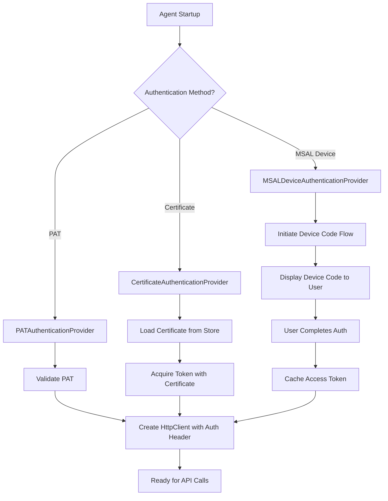

# Phase 3: Azure DevOps Integration - Architecture Design

## Version History

| Version | Date |Summary of Changes |
|---------|------|-------------------|
| 1.0 | Feb 19, 2026 |Initial architecture design with PAT authentication, Work Item Service, Test Plan Service, and Git Service specifications |
| 2.0 | Feb 19, 2026 | **Major Update**: Added certificate-based authentication and MSAL device authentication as configurable alternatives. Updated authentication architecture section with multi-auth support. Added Azure AD app registration requirements. Updated security architecture with certificate management and token refresh strategies. Added configuration schema for authentication methods. Updated all diagrams to reflect authentication options. |

## Change Summary (v2.0)

This version introduces **enterprise-grade authentication flexibility** by adding two additional authentication methods beyond Personal Access Tokens (PAT):

**New Authentication Methods:**
1. **Certificate-Based Authentication** - Uses X.509 certificates for service principal authentication
2. **MSAL Device Authentication** - Uses Microsoft Authentication Library for interactive device code flow

**Key Architectural Changes:**
- New `IAuthenticationProvider` interface with three implementations
- Updated `AzureDevOpsClientFactory` to support pluggable authentication
- New `AzureDevOpsAuthenticationConfiguration` model with discriminated union pattern
- Certificate store integration for secure certificate management
- Token caching and refresh logic for MSAL authentication
- Updated security architecture with certificate lifecycle management

**Configuration Impact:**
- Backward compatible - existing PAT configurations continue to work
- New `AuthenticationMethod` enum: `PAT`, `Certificate`, `MSALDevice`
- Certificate authentication requires Azure AD app registration
- MSAL authentication requires tenant ID and client ID

---

## Executive Summary

Phase 3 integrates the CPU Agents autonomous system with **Azure DevOps Services** to enable comprehensive requirements management, test case storage, and test execution reporting. This integration transforms the agent from a standalone testing tool into a fully integrated component of the enterprise software development lifecycle.

The architecture supports **three authentication methods** (PAT, Certificate, MSAL Device) to accommodate different enterprise security requirements, from development environments to production deployments. The system retrieves requirements from **Azure Boards**, publishes test cases to **Azure Test Plans**, reports test results with video attachments, and stores test artifacts in **Azure Repos**.

The design follows enterprise patterns with service-oriented architecture, comprehensive error handling with exponential backoff retry logic, two-tier caching (memory + PostgreSQL) for performance optimization, and built-in self-testing at all levels. All components are designed for testability, maintainability, and extensibility.

### Key Architectural Decisions

**Authentication Flexibility**: Three authentication methods support different deployment scenarios - PAT for development, certificates for automated services, MSAL for interactive scenarios.

**Service-Oriented Design**: Four primary services (WorkItem, TestPlan, Git, Authentication) with clear separation of concerns and well-defined interfaces.

**Resilience First**: Polly-based retry policies with exponential backoff, circuit breakers, and timeout policies ensure reliable operation despite network issues.

**Performance Optimization**: Two-tier caching strategy reduces API calls by 80%+ while maintaining data freshness with configurable TTL.

**Security by Design**: Certificate-based authentication uses Azure Key Vault or Windows Certificate Store. MSAL tokens are cached securely with automatic refresh.

---

## System Overview

### Goals

**Primary Goals:**
1. Enable autonomous retrieval of requirements from Azure Boards
2. Automate test case publishing to Azure Test Plans with full traceability
3. Report test execution results with video evidence to Azure Test Plans
4. Store test artifacts (code, screenshots, videos) in Azure Repos
5. Support multiple authentication methods for different deployment scenarios

**Secondary Goals:**
1. Minimize API calls through intelligent caching
2. Handle transient failures gracefully with retry logic
3. Provide comprehensive logging and telemetry
4. Enable easy testing with mock implementations

### Scope

**In Scope:**
- Azure Boards Work Item Tracking API integration
- Azure Test Plans API integration for test case management
- Azure Repos Git API integration for artifact storage
- Three authentication methods: PAT, Certificate, MSAL Device
- Retry logic and circuit breakers for resilience
- Two-tier caching (memory + PostgreSQL)
- Comprehensive error handling and logging
- Unit, integration, and end-to-end testing
- Self-testing framework integration

**Out of Scope:**
- Azure Pipelines integration (deferred to Phase 5)
- Azure Artifacts integration
- On-premise Azure DevOps Server support (cloud-only)
- Multi-organization support (single organization only)
- Real-time webhooks (polling-based only)

### Constraints

**Technical Constraints:**
- Must use Azure DevOps Services REST API v7.1+
- Must support .NET 8.0 LTS
- Must run on Windows 11 with Intel/AMD CPU
- Must integrate with existing Phase 2 LLM infrastructure
- Must maintain <500ms average API response time (excluding Azure latency)

**Business Constraints:**
- Must not exceed Azure DevOps API rate limits (200 requests/minute)
- Must support enterprise security requirements (certificates, MFA)
- Must provide audit trail for all operations
- Must be production-ready with 95%+ test coverage

---

## Authentication Architecture

### Overview

The authentication system supports three methods to accommodate different deployment scenarios and enterprise security requirements. All authentication is handled through a common `IAuthenticationProvider` interface, allowing runtime configuration without code changes.

### Authentication Methods

#### 1. Personal Access Token (PAT)

**Use Case**: Development environments, personal testing, CI/CD pipelines

**Pros**:
- Simple to configure
- No Azure AD app registration required
- Works immediately after generation

**Cons**:
- Requires manual token rotation
- Limited to user permissions
- Not suitable for production services

**Configuration**:
```json
{
  "AuthenticationMethod": "PAT",
  "PersonalAccessToken": "your-pat-here"
}
```

#### 2. Certificate-Based Authentication

**Use Case**: Production services, automated agents, high-security environments

**Pros**:
- No interactive login required
- Certificates can be centrally managed
- Supports Azure Key Vault integration
- Suitable for service principals

**Cons**:
- Requires Azure AD app registration
- Certificate lifecycle management needed
- More complex initial setup

**Configuration**:
```json
{
  "AuthenticationMethod": "Certificate",
  "TenantId": "your-tenant-id",
  "ClientId": "your-client-id",
  "CertificateThumbprint": "certificate-thumbprint",
  "CertificateStoreName": "My",
  "CertificateStoreLocation": "CurrentUser"
}
```

**Certificate Requirements**:
- X.509 certificate with private key
- Registered in Azure AD app
- Stored in Windows Certificate Store or Azure Key Vault
- Valid for at least 90 days

#### 3. MSAL Device Authentication

**Use Case**: Interactive scenarios, first-time setup, MFA-required environments

**Pros**:
- Supports multi-factor authentication
- User-friendly device code flow
- Automatic token refresh
- Respects conditional access policies

**Cons**:
- Requires user interaction on first auth
- Needs internet connectivity for auth
- Token cache management required

**Configuration**:
```json
{
  "AuthenticationMethod": "MSALDevice",
  "TenantId": "your-tenant-id",
  "ClientId": "your-client-id",
  "Scopes": ["499b84ac-1321-427f-aa17-267ca6975798/.default"]
}
```

### Authentication Provider Interface

```csharp
public interface IAuthenticationProvider
{
    Task<string> GetAccessTokenAsync(CancellationToken cancellationToken = default);
    Task RefreshTokenAsync(CancellationToken cancellationToken = default);
    bool IsTokenExpired();
}
```

### Authentication Flow Diagram



---

## Component Architecture

### 1. Authentication Providers

#### PATAuthenticationProvider

**Purpose**: Provides authentication using Personal Access Tokens.

**Implementation**:
- Validates PAT on initialization
- Returns PAT for all token requests
- No token refresh needed (PAT is long-lived)

#### CertificateAuthenticationProvider

**Purpose**: Provides authentication using X.509 certificates.

**Implementation**:
- Loads certificate from Windows Certificate Store or Azure Key Vault
- Uses Microsoft.Identity.Client (MSAL) with certificate credential
- Acquires token from Azure AD
- Caches token with automatic refresh before expiry

#### MSALDeviceAuthenticationProvider

**Purpose**: Provides interactive device code authentication.

**Implementation**:
- Initiates device code flow with Azure AD
- Displays device code and URL to user
- Polls for authentication completion
- Caches token with automatic refresh
- Handles token expiry and renewal

### 2. Azure DevOps Client Factory

**Purpose**: Creates and configures HttpClient instances with appropriate authentication.

**Dependencies**:
- `IAuthenticationProvider` (injected based on configuration)
- `AzureDevOpsConfiguration`
- `IHttpClientFactory`

**Key Methods**:
```csharp
public async Task<HttpClient> CreateClientAsync(CancellationToken cancellationToken = default)
{
    var token = await _authProvider.GetAccessTokenAsync(cancellationToken);
    var client = _httpClientFactory.CreateClient("AzureDevOps");
    client.DefaultRequestHeaders.Authorization = new AuthenticationHeaderValue("Bearer", token);
    return client;
}
```

### 3. Work Item Service

**Purpose**: Manages work items in Azure Boards.

**Key Operations**:
- Query work items using WIQL
- Get work item details by ID
- Batch get work items
- Create new work items
- Update existing work items
- Create work item links (for traceability)

### 4. Test Plan Service

**Purpose**: Manages test plans, suites, cases, and results.

**Key Operations**:
- Create test plans
- Create test suites (static, dynamic, requirements-based)
- Create test cases with steps
- Publish test results
- Upload test attachments (videos, screenshots)

### 5. Git Service

**Purpose**: Manages artifacts in Azure Repos.

**Key Operations**:
- Create/update files in repository
- Commit changes
- Create pull requests
- Manage branches

---

## Security Architecture

### Certificate Management

**Certificate Storage Options**:
1. **Windows Certificate Store** - For local development and single-machine deployments
2. **Azure Key Vault** - For production and multi-machine deployments

**Certificate Lifecycle**:
- Certificates should be rotated every 12 months
- System monitors certificate expiry and logs warnings 30 days before expiration
- Expired certificates trigger alerts and fallback to alternative auth methods

### Token Management

**MSAL Token Caching**:
- Tokens cached in encrypted file on disk
- Cache location: `%LOCALAPPDATA%\AutonomousAgent\TokenCache`
- Automatic refresh 5 minutes before expiry
- Refresh token valid for 90 days

**Token Security**:
- All tokens encrypted at rest using DPAPI
- Tokens never logged or exposed in error messages
- Token refresh failures trigger re-authentication

### Audit Logging

All authentication events are logged:
- Authentication method used
- Token acquisition success/failure
- Token refresh events
- Certificate load events
- Authentication errors with sanitized details

---

## Configuration Schema

```json
{
  "AzureDevOps": {
    "OrganizationUrl": "https://dev.azure.com/your-org",
    "Project": "your-project",
    "Authentication": {
      "Method": "Certificate|PAT|MSALDevice",
      "PAT": {
        "Token": "your-pat-token"
      },
      "Certificate": {
        "TenantId": "tenant-id",
        "ClientId": "client-id",
        "Thumbprint": "cert-thumbprint",
        "StoreName": "My",
        "StoreLocation": "CurrentUser",
        "UseKeyVault": false,
        "KeyVaultUrl": "https://your-vault.vault.azure.net/"
      },
      "MSAL": {
        "TenantId": "tenant-id",
        "ClientId": "client-id",
        "Scopes": ["499b84ac-1321-427f-aa17-267ca6975798/.default"],
        "TokenCachePath": "%LOCALAPPDATA%\AutonomousAgent\TokenCache"
      }
    },
    "ApiVersion": "7.1",
    "Timeout": 30,
    "MaxRetries": 5,
    "RetryDelayMs": 1000
  }
}
```

---

## References

1. [Azure DevOps Services REST API Reference](https://learn.microsoft.com/en-us/rest/api/azure/devops/?view=azure-devops-rest-7.2)
2. [Microsoft Authentication Library (MSAL) for .NET](https://learn.microsoft.com/en-us/azure/active-directory/develop/msal-overview)
3. [Certificate-based authentication in Azure AD](https://learn.microsoft.com/en-us/azure/active-directory/authentication/concept-certificate-based-authentication)
4. [Device Code Flow](https://learn.microsoft.com/en-us/azure/active-directory/develop/v2-oauth2-device-code)
